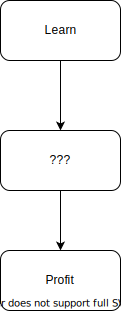

# some-gears

This is intended to help developers learn graphql by starting at the very basics and growing to a set of complex applications that are similar to what would be found in a production environment.

## Motivation




There are already many excellent tutorials for graphql, this is not intended to replace those.  There are also many getting started repositories out there, while some-gears does that, it also seeks to show developers how to go from there to actual working examples that are non-trivial.

A developer should be able to start with the simplest examples of databases and clients and work through subsequent more realistic examples.

## Notably absent

### Getting Started in XYZ

There are no instructions for things like creating a database, web application, or other details that are very well documented elsewher; a quick search will usually satisfy the developers need to learn how to perform those getting started tasks and management tasks.

### Docker, Compose, Kubernetes, Cloud Formation...

There are Dockerfiles in many, but not all cases.

As of now there are no Compose, or Kubernetes files, though these could be valuable additions to allow a developer to quickly see how the parts work together.

## Tech Stack (partial list)

The assumption, initially, is that the developer uses Javascript Node alread. (a simple .Net Core application is also available, using HotChocolate).

The goal is to grow this to Rust, R, Elixer, Elm, Python, R, Kotlin, Swift, Dart, and D; roughly in that order.

## Layout - Data Services, Databases, UIs

### Data Services

* Postgraphile

* Apollo

* Express

* Hasura

* DGraph

* HotChocolate

*Notably absent is Prisma, which has just been rewritten in Rust and is just now in Preview (as of March 4, 2020).  When I have time, I will add Prisma, or if someone wants to add Prisma 2 that would be awesome. I would like to avoid Prisma 1, since Prisma 2 looks to be much better*

### Databases

* Postgres

* DGraph

* SQL Server

* Neo4j

Notably absent is MySQL, which can be added by anyone willing to help out. Other missing databases: MariaDB, MongoDB, Couch, etc.


### Structure

The code is broken into a sensible set of folders, that is certainly up for debate. The initial structure looks like (generated with: )

```├── data-services
│   ├── graphql
│   ├── hasura
│   ├── postgraphile
│   │   ├── express
│   │   └── express-apollo
│   └── prisma
├── databases
│   ├── dgraph
│   │   ├── blog
│   │   ├── identity
│   │   └── mimi
│   ├── neo4j
│   │   ├── blog
│   │   ├── identity
│   │   └── mimi
│   ├── postgres
│   │   ├── blog
│   │   ├── identity
│   │   └── mimi
│   └── sqlserver
│       ├── blog
│       ├── identity
│       └── mimi
└── ui
    └── web
        ├── angular
        │   └── one
        ├── preact
        │   └── one
        ├── react
        │   └── one
        └── vue
            └── one
```

Initially the database ddls are simple, as complexity grows more complex ddls will be placed in a set of folders named respective of their complexity, similar to the web folder (but with different names indicating complexity (potentially names like wood, copper, iron, steel...), this would also apply to services layer.

The web applications one through five will use the initial services and databases.


## Top most folders

### data-services 

Where the graphql services live.  See the README in each of the folders under the data-services folder.  When it makes sense there will be more complex services under the data-services child folders

## databases

What it sounds like, backups of the databases, and ddl.

## ui

Only web for now, applications for React, Preact, Vue, and Angular

